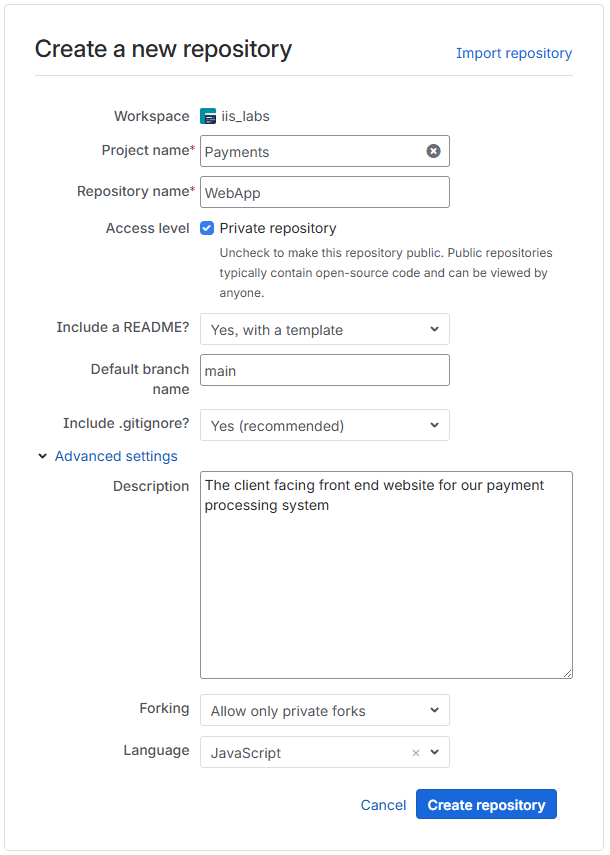
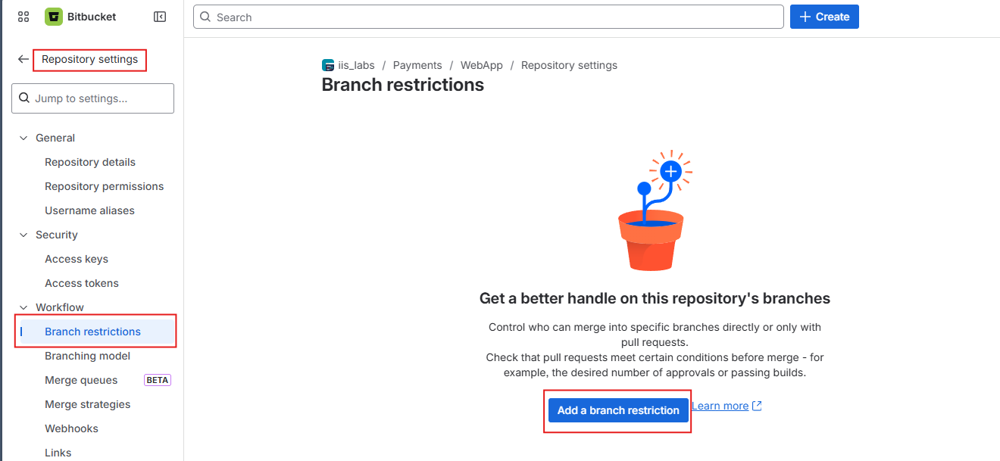
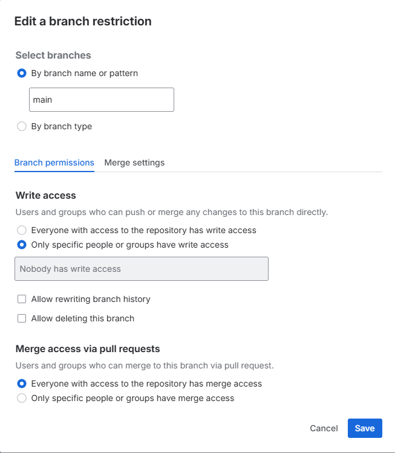
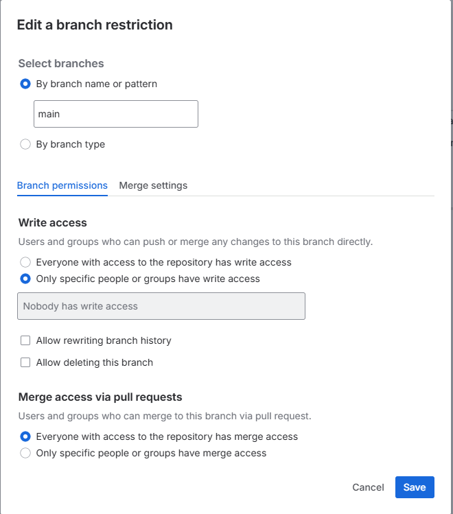

# Lab 1.3 – Repository Governance & Collaboration

**Duration:** ~45 minutes  
**Prerequisites:** Bitbucket account, a partner to pair with

## Learning Objectives

By the end of this lab you will be able to:
- Create a Bitbucket repository and configure branch restrictions on `main`
- Open a Pull Request and assign a reviewer
- Review a Pull Request, add a task, and approve it
- Require approvals before a branch can be merged
- Configure a webhook to notify an external system when repository events occur

---

## Overview

This lab is the most important one of the day. Everything covered in the slides comes together here, including branch restrictions, Pull Requests, code reviews, approval requirements, and webhooks.

You will work in pairs. One student acts as the **Repository Owner** (Student A) and one as the **Reviewer** (Student B). After completing the first round, you will switch roles so both students experience each side of the workflow.

Most students will leave this lab remembering: *"I created a PR and my teammate approved it."* That is exactly the learning objective: the mechanics of governed collaboration through Bitbucket.

---

## Hands On

### Part 1 – Student A: Create the Repository

**Student A** completes the steps in this section. Student B observes.

1. Log in to Bitbucket and create a new repository. Use your workspace, give it a meaningful name (e.g., `governance-lab-<yourname>`), keep the default branch as `main`, and include a README.

   

2. Navigate to **Repository settings** in the left sidebar, then select **Branch restrictions** under the **Workflow** section.

   

3. Click **Add a branch restriction**. Configure the restriction to protect `main`:

   - **Select branches:** By branch name or pattern, enter `main`
   - **Write access:** Select *Only specific people or groups have write access*, and leave the field empty (nobody has direct write access)
   - Leave *Allow rewriting branch history* and *Allow deleting this branch* unchecked

   This prevents anyone from pushing directly to `main`. All changes must go through a Pull Request.

   

4. Click **Save**.

---

### Part 2 – Student A: Create a Branch and Open a Pull Request

5. Clone the repository to your local machine using VS Code or Git Bash.

6. Create a new branch named `feature/update-readme`:

   ```bash
   git checkout -b feature/update-readme
   ```

7. Open `README.md` and add a short description of the repository. Save the file, stage it, and commit:

   ```bash
   git add README.md
   git commit -m "Update README with repository description"
   git push -u origin feature/update-readme
   ```

8. In Bitbucket, open a Pull Request from `feature/update-readme` to `main`. Add a clear title and description. Under **Reviewers**, add Student B as a reviewer. Submit the PR.

---

### Part 3 – Student B: Review the Pull Request

**Student B** completes the steps in this section.

9. Open the Pull Request Student A created. Read through the description and the diff.

10. Add a comment on a specific line of the diff — click the `+` icon that appears when you hover over a line. Leave a short note such as *"Looks clear, but consider adding a usage section."*

11. Add a **task** to the Pull Request. Tasks are action items the author must address before the PR can be approved. Click **Add task** and write something like: *"Add a Usage section to the README before merging."*

12. Do **not** approve yet. The task is open — Student A must address it first.

---

### Part 4 – Student A: Resolve the Task and Request Re-Review

13. Add a `## Usage` section to `README.md` on the same branch, commit, and push:

    ```bash
    git add README.md
    git commit -m "Add Usage section to README"
    git push
    ```

    The new commit automatically appears in the open Pull Request.

14. In Bitbucket, mark the task as **resolved**.

---

### Part 5 – Student B: Approve and Merge

15. Review the updated diff. Confirm the task has been addressed.

16. Click **Approve**. The Pull Request now has one approval.

17. Before merging, go back to **Repository settings > Branch restrictions** and open the `main` restriction. Switch to the **Merge settings** tab and require a minimum of **1 approval** before the branch can be merged.

    

18. Return to the Pull Request and merge it. Because the approval requirement is now enforced, the merge should proceed without issue. Review the merge strategy options available (merge commit, squash, fast-forward). Select **Merge commit** to preserve full history.

---

### Part 6 – Configure a Webhook (Optional)

Webhooks send a notification to an external URL whenever a repository event occurs, such as a push, a PR being opened, or a merge completing.

19. In **Repository settings**, navigate to **Webhooks** in the left sidebar. Click **Add webhook**.

20. Give it a title such as `Lab Notification`. Choose one of the following destinations for the webhook URL:

    **Option A: webhook.site (quick, no setup)**
    Open **webhook.site** in a new tab. Copy the unique URL shown on the page and paste it into the Bitbucket webhook URL field. All incoming requests will be displayed on that page in real time.

    **Option B: Slack incoming webhook**
    In Slack, go to **Apps** and search for **Incoming WebHooks**. Select a channel to post to, click **Add Incoming WebHooks Integration**, and copy the webhook URL provided. Paste it into the Bitbucket webhook URL field. Bitbucket will post a JSON payload to that URL, and Slack will display a notification in the selected channel.

21. Under **Triggers**, select **Pull Request: Created** and **Repository: Push**. Save the webhook.

22. Make a small change on a new branch, push it, and open a Pull Request. Check your chosen destination and observe the payload Bitbucket sent.

    The payload contains the event type, the repository details, the branch name, and the actor who triggered the event. This is the same mechanism CI/CD systems use to start automated builds when code is pushed.

---

### Part 7 – Switch Roles

23. Student B now creates a second repository, and Student A becomes the reviewer. Repeat Parts 1 through 5 with roles reversed so both students experience creating and enforcing branch restrictions and reviewing a Pull Request.

---

## Summary

In this lab you:
- Created a Bitbucket repository and protected `main` using branch restrictions
- Opened a Pull Request, assigned a reviewer, and experienced the full review and approval workflow
- Used review tasks to document required changes before approval
- Enforced a minimum approval requirement before merging
- Configured a webhook and observed the event payload sent to an external system

## Challenge

In Repository settings, explore the **Branching model** section. Bitbucket can automatically enforce branch naming conventions and assign branch types (feature, bugfix, hotfix, release). Configure a branching model that:

- Designates `main` as the production branch
- Requires feature branches to be prefixed with `feature/`
- Requires hotfix branches to be prefixed with `hotfix/`

After saving the model, create a branch with an invalid name (e.g., `my-change`) and attempt to open a PR. Observe how Bitbucket handles branches that do not conform to the model.
