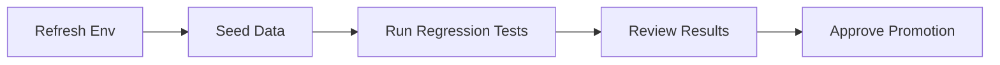
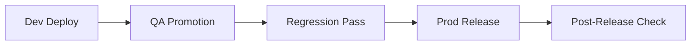

# Lab 3.1 - Confluence: Process Documentation and Migration Planning

**Duration:** ~20 minutes  
**Prerequisites:** Completed Labs 1.x and 2.x

## Learning Objectives

By the end of this lab you will be able to:
- Create clear Confluence pages for current team workflows
- Document testing and release processes in a simple, repeatable format
- Build a basic migration plan page with owners and risks
- Add simple visuals to make process documentation easier to understand

---

## Why This Matters

Teams usually know how work gets done, but that knowledge is often spread across chats, tribal knowledge, and old documents. Confluence helps turn that into one shared, maintained source of truth.

In this lab, you will document your current testing and release process, then create a basic migration plan page.

---

## Scenario

Your team needs better documentation before making platform changes. Leadership asked for:
- One page that explains how testing works today
- One page that explains how releases work today
- One page with a simple migration plan

---

## Hands On

### Part 1 - Create a Lab Section in Confluence

1. Log in to Confluence.
2. Open your team training space.
3. Create a parent page named:

	 `SDLC Process Documentation`

4. Under that parent page, create three child pages:
	 - `Current Testing Process`
	 - `Current Release Process`
	 - `Migration Plan (Basic)`

---

### Part 2 - Document Current Testing Process

On `Current Testing Process`, add this structure:

```markdown
# Current Testing Process

## Purpose
Describe why we test before promotion.

## Trigger
- Weekly cycle
- Pull request opened
- Manual run

## Environments
- Dev
- QA
- Prod (validation only)

## Basic Flow
1. Refresh environment
2. Seed test data
3. Run regression tests
4. Review failures
5. Approve for promotion

## Owner
Who is responsible for test execution and sign-off.
```

Add one simple table:

| Step | Tool | Output |
|---|---|---|
| Seed data | Pipeline script | Test records created |
| Run tests | Test runner | Pass/fail report |
| Review | Team lead | Go/no-go decision |

---

### Part 3 - Document Current Release Process

On `Current Release Process`, add this structure:

```markdown
# Current Release Process

## Purpose
Describe how code moves safely across environments.

## Promotion Path
Dev -> QA -> Prod

## Release Steps
1. Merge approved changes
2. Deploy to Dev
3. Validate smoke tests
4. Promote to QA
5. Run regression tests
6. Approve and promote to Prod

## Rollback
If validation fails, roll back to the last stable version.

## Release Owner
Name the role that approves production release.
```

---

### Part 4 - Create a Basic Migration Plan

On `Migration Plan (Basic)`, add this structure:

```markdown
# Migration Plan (Basic)

## Goal
Document what changes, what stays the same, and how risk is controlled.

## Scope
- Platform/runtime changes
- Pipeline updates
- Documentation updates

## What Stays the Same
- Test strategy
- Promotion gates
- Approval process

## What Changes
- Deployment target
- Environment configuration
- Monitoring setup

## Risks and Mitigations
| Risk | Impact | Mitigation | Owner |
|---|---|---|---|
| Pipeline mismatch | Failed deploy | Parallel validation runs | DevOps |
| Missing config | Runtime errors | Config checklist | Team lead |
| Test drift | False confidence | Baseline regression suite | QA |

## Phases
1. Assess current state
2. Prepare target platform
3. Run in parallel
4. Cut over
5. Stabilize and review
```

---

### Part 5 - Add Basic Visuals (Bonus)

Add one diagram to each process page using the Mermaid macro or code block.

Testing flow visual:



Release flow visual:



---

## Validation Checklist

Before completing the lab, confirm:
- Parent page created
- `Current Testing Process` page created and filled in
- `Current Release Process` page created and filled in
- `Migration Plan (Basic)` page created and filled in
- At least one process table added
- At least one visual added

---

## Discussion Questions

1. Which step in your current release process is least documented?
2. Which migration risk is most likely for your team?
3. What should be reviewed weekly to keep documentation accurate?

---

## Summary

In this lab you:
- Documented current testing and release workflows in Confluence
- Created a basic migration plan with phases, risks, and owners
- Added simple visuals to improve clarity

You now have a baseline documentation structure that supports change planning and team alignment.