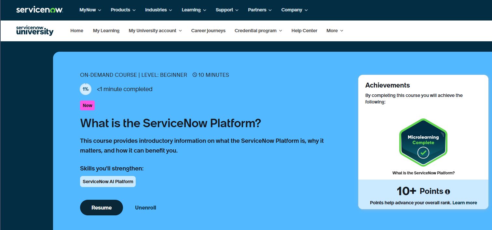
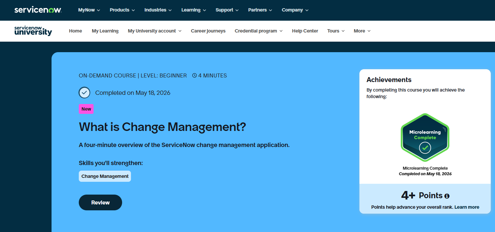
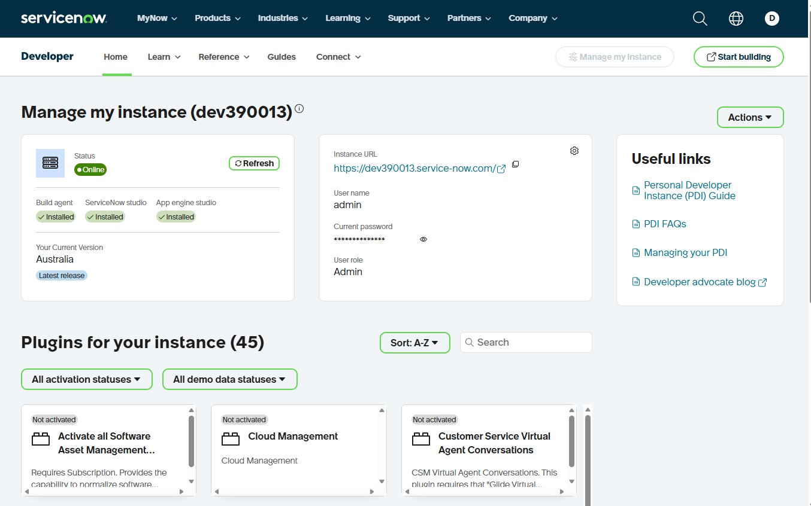
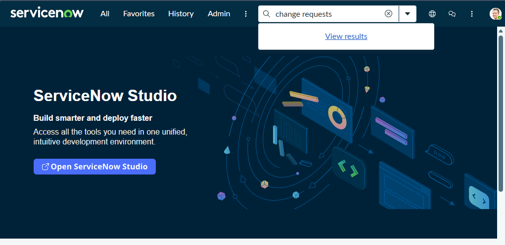

# Lab 3.2 - ServiceNow: Change Management and IT Operations

**Duration:** ~30 minutes  
**Prerequisites:** Completed Lab 3.1

## Learning Objectives

By the end of this lab you will be able to:
- Describe what ServiceNow is and where it fits in the SDLC
- Navigate the ServiceNow platform and locate Change Requests
- Use ServiceNow Learning to understand the Change Management process
- Explore dashboards to understand how IT operations are monitored

---

## Why This Matters

ServiceNow (SNOW) is the industry standard for IT Service Management. It provides a centralized platform for tracking incidents, managing changes, maintaining a knowledge base, and operating IT workflows. Understanding how SNOW fits into your delivery lifecycle helps teams coordinate changes safely, reduce risk, and maintain visibility across environments.

Most enterprise teams use SNOW as the system of record for change approvals. Knowing how to navigate it is a critical skill for anyone involved in releasing software.

---

## Scenario

Your team is preparing for a platform migration. Before any change is approved for production, it must go through the Change Management process in ServiceNow. In this lab, you will learn what that process looks like by exploring the platform directly — using both the Learning portal and a live developer sandbox.

---

## Hands On

### Part 1 - ServiceNow Learning Portal

The ServiceNow Learning portal is where you go to understand the platform, earn certifications, and build foundational knowledge before working in a live instance.

1. Go to the ServiceNow Learning portal and sign up or log in:

   [https://learning.servicenow.com/now/lxp/home](https://learning.servicenow.com/now/lxp/home)

2. Search for and take the **"What is the ServiceNow Platform"** course (~10 minutes).

   

3. Search for and take the **"What is Change Management"** course (~4 minutes).

   

4. After completing both courses, answer these questions for yourself:
   - What is the difference between an **incident** and a **change request**?
   - Who typically approves a change in an enterprise environment?
   - Why does Change Management matter before a production release?

---

### Part 2 - ServiceNow Developer Sandbox

The ServiceNow Developer program gives you a free, fully functional instance of the platform to explore. This is the same platform used in enterprise environments.

1. Go to the ServiceNow Developer site and sign in:

   [https://developer.servicenow.com/](https://developer.servicenow.com/)

2. Request a personal developer instance. Select the nearest available region and click **Deploy**.

   

   > Once your instance is ready, you will see the instance URL and login credentials. Keep these handy.

3. Log in to your ServiceNow instance using the provided credentials.

---

### Part 3 - Explore Change Requests

Change Requests are the formal record of a planned change to a system. Every production deployment in a SNOW-governed environment requires one.

1. In the top search bar, type **"Change"** and select **Change > All** from the results.

   

2. Open any existing Change Request from the list.

3. Review the following fields on the record:
   - **State** — where is this change in its lifecycle?
   - **Risk** — how was risk assessed?
   - **Assignment Group** — who owns this change?
   - **Implementation Plan** — what steps are planned?
   - **Backout Plan** — how will this be reversed if something goes wrong?

4. Click through the tabs on the Change Request (Planning, Schedule, Conflicts, etc.) to see the full scope of information captured.

---

### Part 4 - Explore Dashboards

Dashboards give operations teams a real-time view of activity across the platform. They are commonly used during and after production releases.

1. In the top navigation, click **All** and search for **Dashboards**.

2. Open the Dashboards section and take the tour if prompted.

3. Browse two or three existing dashboards and observe:
   - What metrics are being tracked?
   - Which dashboards would be useful during a release window?
   - What would you want to see on a dashboard for your own team?

---

## Validation Checklist

Before completing the lab, confirm:
- Completed the "What is the ServiceNow Platform" course
- Completed the "What is Change Management" course
- Logged in to a personal developer instance
- Opened and reviewed a Change Request including its tabs
- Explored at least two dashboards

---

## Discussion Questions

1. At what point in the release process should a Change Request be opened?
2. What information would your team need to fill out the Implementation Plan and Backout Plan fields?
3. How would a ServiceNow-gated approval process change your current deployment workflow?
4. What types of incidents or changes would you track in SNOW for your current project?

---

## Summary

In this lab you:
- Used the ServiceNow Learning portal to understand the platform and Change Management process
- Deployed a personal developer instance and logged in
- Navigated Change Requests and reviewed the structured data they capture
- Explored dashboards used for operational visibility

You now understand how ServiceNow functions as the system of record for change governance and how it fits into an enterprise software delivery lifecycle.
